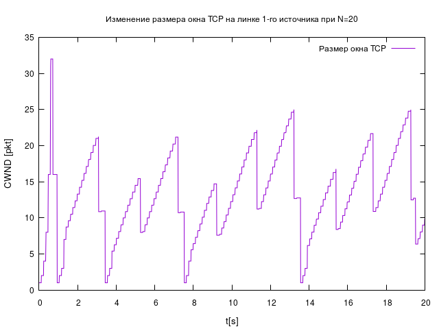
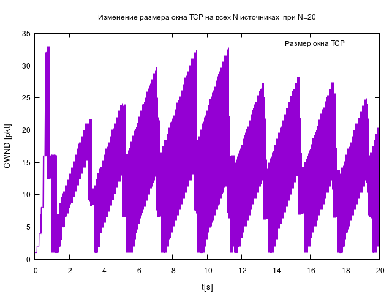
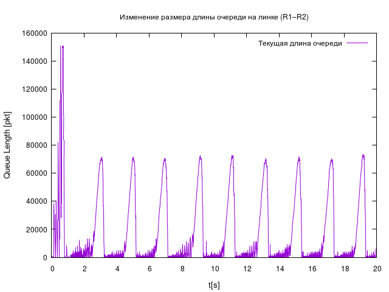
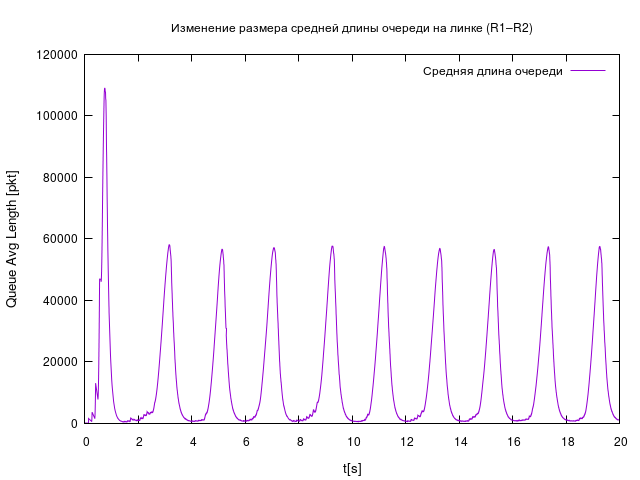

---
## Front matter
lang: ru-RU
title: Лабораторная работа №4
subtitle: Задание для самостоятельного выполнения
author:
  - Игнатенкова В. Н.
institute:
  - Российский университет дружбы народов, Москва, Россия

## i18n babel
babel-lang: russian
babel-otherlangs: english

## Formatting pdf
toc: false
toc-title: Содержание
slide_level: 2
aspectratio: 169
section-titles: true
theme: metropolis
header-includes:
 - \metroset{progressbar=frametitle,sectionpage=progressbar,numbering=fraction}
 - '\makeatletter'
 - '\beamer@ignorenonframefalse'
 - '\makeatother'
---

# Информация

## Докладчик

:::::::::::::: {.columns align=center}
::: {.column width="60%"}

  * Игнатенкова Варвара Николаевна
  * студентка
  * Российский университет дружбы народов
  * [1132226497@pfur.ru](mailto:1132226497@pfur.ru)
  * <https://github.com/vnignatenkovarudn>

:::
::: {.column width="25%"}


:::
::::::::::::::

## Цель работы

Выполнить задание для самостоятельного выполнения.

## Задание

1. Для приведённой схемы разработать имитационную модель в пакете NS-2;
2. Построить график изменения размера окна TCP (в Xgraph и в GNUPlot);
3. Построить график изменения длины очереди и средней длины очереди на первом
маршрутизаторе;
4. Оформить отчёт о выполненной работе.

## Выполнение лабораторной работы

Описание моделируемой сети:

- сеть состоит из N TCP-источников, N TCP-приёмников, двух маршрутизаторов
R1 и R2 между источниками и приёмниками (N — не менее 20);
- между TCP-источниками и первым маршрутизатором установлены дуплексные
соединения с пропускной способностью 100 Мбит/с и задержкой 20 мс очередью
типа DropTail;
- между TCP-приёмниками и вторым маршрутизатором установлены дуплексные
соединения с пропускной способностью 100 Мбит/с и задержкой 20 мс очередью
типа DropTail;

## Выполнение лабораторной работы

- между маршрутизаторами установлено симплексное соединение (R1–R2) с пропускной способностью 20 Мбит/с и задержкой 15 мс очередью типа RED, размером буфера 300 пакетов; в обратную сторону — симплексное соединение (R2–R1) с пропускной способностью 15 Мбит/с и задержкой 20 мс очередью типа DropTail;
- данные передаются по протоколу FTP поверх TCPReno;
- параметры алгоритма RED: $q_min = 75, q_max = 150, q_w = 0, 002, p_max = 0.1$;
- максимальный размер TCP-окна 32; размер передаваемого пакета 500 байт; время
моделирования — не менее 20 единиц модельного времени.

## Выполнение лабораторной работы

```
# создание объекта Simulator
set ns [new Simulator]
# открытие на запись файла out.nam для визуализатора nam
set nf [open out.nam w]
# все результаты моделирования будут записаны в переменную nf
$ns namtrace-all $nf
# открытие на запись файла трассировки out.tr
# для регистрации всех событий
set f [open out.tr w]
# все регистрируемые события будут записаны в переменную f
$ns trace-all $f

Agent/TCP set window_ 32
Agent/TCP set pktSize_ 500
```

## Выполнение лабораторной работы

```
# процедура finish
proc finish {} {
	global tchan_
	# подключение кода AWK:
	set awkCode {
	{
		if ($1 == "Q" && NF>2) {
			print $2, $3 >> "temp.q";
			set end $2
	}
		else if ($1 == "a" && NF>2)
			print $2, $3 >> "temp.a";
	}
}
```

## Выполнение лабораторной работы

```
exec rm -f temp.q temp.a
exec touch temp.a temp.q

exec awk $awkCode all.q

# Запуск xgraph с графиками окна TCP и очереди:
exec xgraph -fg green -bg blue -bb -tk -x time -t "TCPRenoCWND" WindowVsTimeRenoOne &
exec xgraph -fg green -bg blue -bb -tk -x time -t "TCPRenoCWND" WindowVsTimeRenoAll &
exec xgraph -bb -tk -x time -y queue temp.q &
exec xgraph -bb -tk -x time -y queue temp.a &
exec nam out.nam &
exit 0
}
```

## Выполнение лабораторной работы

```
# Формирование файла с данными о размере окна TCP:
proc plotWindow {tcpSource file} {
	global ns
	set time 0.01
	set now [$ns now]
	set cwnd [$tcpSource set cwnd_]
	puts $file "$now $cwnd"
	$ns at [expr $now+$time] "plotWindow $tcpSource $file"
}
```

## Выполнение лабораторной работы

```
set r1 [$ns node]
set r2 [$ns node]
$ns simplex-link $r1 $r2 20Mb 15ms RED
$ns simplex-link $r2 $r1 15Mb 20ms DropTail
$ns queue-limit $r1 $r2 300

set N 20
for {set i 0} {$i < $N} {incr i} {
	set n1($i) [$ns node]
	$ns duplex-link $n1($i) $r1 100Mb 20ms DropTail
	set n2($i) [$ns node]
	$ns duplex-link $n2($i) $r2 100Mb 20ms DropTail
	set tcp($i) [$ns create-connection TCP/Reno $n1($i) TCPSink $n2($i) $i]
	set ftp($i) [$tcp($i) attach-source FTP]
}
```

## Выполнение лабораторной работы

```
# Мониторинг размера окна TCP:
set windowVsTimeOne [open WindowVsTimeRenoOne w]
set windowVsTimeAll [open WindowVsTimeRenoAll w]

set qmon [$ns monitor-queue $r1 $r2 [open qm.out w] 0.1];
[$ns link $r1 $r2] queue-sample-timeout;

# Мониторинг очереди:
set redq [[$ns link $r1 $r2] queue]
$redq set thresh_ 75
$redq set maxthresh_ 150
$redq set q_weight_ 0.002
$redq set linterm_ 10

set tchan_ [open all.q w]
$redq trace curq_
$redq trace ave_
$redq attach $tchan_
```

## Выполнение лабораторной работы

```
for {set i 0} {$i < $N} {incr i} {
	$ns at 0.0 "$ftp($i) start"
	$ns at 0.0 "plotWindow $tcp($i) $windowVsTimeAll"
}

$ns at 0.0 "plotWindow $tcp(1) $windowVsTimeOne"

# at-событие для планировщика событий, которое запускает
# процедуру finish через 20s после начала моделирования
$ns at 20.0 "finish"
# запуск модели
$ns run
```

## Выполнение лабораторной работы

{#fig:001 width=60%}

## Выполнение лабораторной работы

{#fig:002 width=60%}

## Выполнение лабораторной работы

{#fig:003 width=50%}

## Выполнение лабораторной работы

{#fig:004 width=60%}

## Выполнение лабораторной работы

{#fig:005 width=60%}

## Выполнение лабораторной работы

```
#!/usr/bin/gnuplot -persist
# задаём текстовую кодировку,
# тип терминала, тип и размер шрифта

set encoding utf8
set term pngcairo font "Helvetica,9"
```

## Выполнение лабораторной работы

```
# задаём выходной файл графика
set out 'window_1.png'

# задаём название графика
set title "Изменение размера окна TCP на линке 1-го источника при N=30"

# подписи осей графика
set xlabel "t[s]" font "Helvetica, 10"
set ylabel "CWND [pkt]" font "Helvetica, 10"

# построение графика, используя значения
# 1-го и 2-го столбцов файла WindowVsTimeRenoOne
plot "WindowVsTimeRenoOne" using ($1):($2) with lines title "Размер окна TCP"
```

## Выполнение лабораторной работы

```
# задаём выходной файл графика
set out 'window_2.png'

# задаём название графика
set title "Изменение размера окна TCP на всех N источниках  при N=0"

# построение графика, используя значения
# 1-го и 2-го столбцов файла WindowVsTimeRenoAll
plot "WindowVsTimeRenoAll" using ($1):($2) with lines title "Размер окна TCP"
```

## Выполнение лабораторной работы

```
# задаём выходной файл графика
set out 'queue.png'

# задаём название графика
set title "Изменение размера длины очереди на линке (R1–R2)"

# подписи осей графика
set xlabel "t[s]" font "Helvetica, 10"
set ylabel "Queue Length [pkt]" font "Helvetica, 10"

# построение графика, используя значения
# 1-го и 2-го столбцов файла temp.q
plot "temp.q" using ($1):($2) with lines title "Текущая длина очереди"
```

## Выполнение лабораторной работы

```
# задаём выходной файл графика
set out 'av_queue.png'

# задаём название графика
set title "Изменение размера средней длины очереди на линке (R1–R2)"

# подписи осей графика
set xlabel "t[s]" font "Helvetica, 10"
set ylabel "Queue Avg Length [pkt]" font "Helvetica, 10"

# построение графика, используя значения
# 1-го и 2-го столбцов файла temp.a
plot "temp.a" using ($1):($2) with lines title "Средняя длина очереди"
```

## Выполнение лабораторной работы

{#fig:006 width=60%}

## Выполнение лабораторной работы

{#fig:007 width=60%}

## Выполнение лабораторной работы

{#fig:008 width=60%}

## Выполнение лабораторной работы

{#fig:009 width=60%}

## Выводы

В результате выполнения данной лабораторной работы была разработана имитационная модель в пакете NS-2, построены графики изменения размера окна TCP, изменения длины очереди и средней длины очереди.