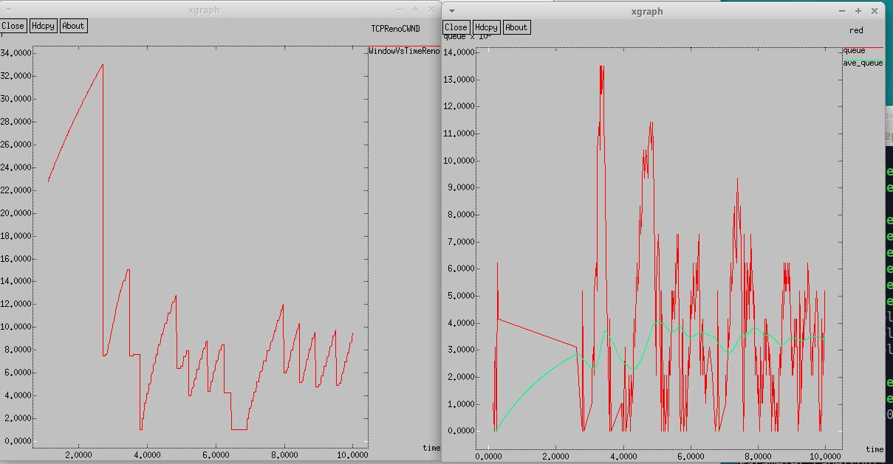
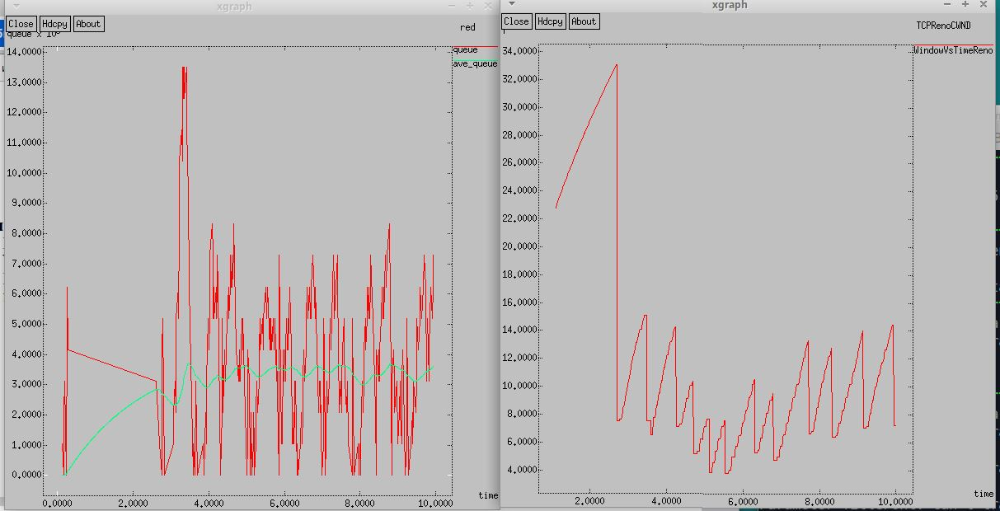
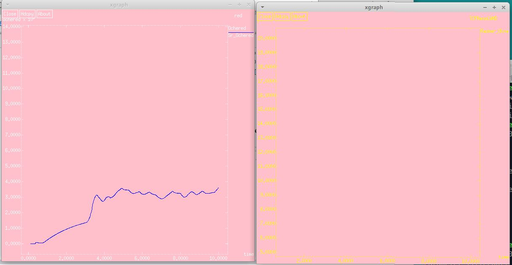

---
## Front matter
lang: ru-RU
title: Лабораторная работа №2
subtitle: Исследование протокола TCP и алгоритма управления очередью RED
author:
  - Игнатенкова В. Н.
institute:
  - Российский университет дружбы народов, Москва, Россия

## Generic otions
lang: ru-RU
toc-title: "Содержание"

## Bibliography
csl: pandoc/csl/gost-r-7-0-5-2008-numeric.csl

## Pdf output format
toc: true # Table of contents
toc-depth: 2

fontsize: 12pt
linestretch: 1.5
papersize: a4
documentclass: scrreprt
## I18n polyglossia
polyglossia-lang:
  name: russian
  options:
	- spelling=modern
	- babelshorthands=true
polyglossia-otherlangs:
  name: english
## I18n babel
babel-lang: russian
babel-otherlangs: english
## Fonts
mainfont: PT Serif
romanfont: PT Serif
sansfont: PT Sans
monofont: PT Mono
mainfontoptions: Ligatures=TeX
romanfontoptions: Ligatures=TeX
sansfontoptions: Ligatures=TeX,Scale=MatchLowercase
monofontoptions: Scale=MatchLowercase,Scale=0.9
## Biblatex
biblatex: true
biblio-style: "gost-numeric"
biblatexoptions:
  - parentracker=true
  - backend=biber
  - hyperref=auto
  - language=auto
  - autolang=other*
  - citestyle=gost-numeric
## Misc options
indent: true
header-includes:
  - \usepackage{indentfirst}
  - \usepackage{float} # keep figures where there are in the text
  - \floatplacement{figure}{H} # keep figures where there are in the text
---

# Информация

## Докладчик

:::::::::::::: {.columns align=center}

  * Игнатенкова Варвара Николаевна
  * студентка
  * Российский университет дружбы народов
  * [1132226497@pfur.ru](mailto:1132226497@pfur.ru)

### Цель работы

Исследовать протокол TCP и алгоритм управления очередью RED.

### Задание

1. Выполнить пример с дисциплиной RED;
2. Изменить в модели на узле s1 тип протокола TCP с Reno на NewReno, затем на
Vegas. Сравнить и пояснить результаты;
3. Внести изменения при отображении окон с графиками (изменить цвет фона,
цвет траекторий, подписи к осям, подпись траектории в легенде).

### Выполнение лабораторной работы

{#fig:001 width=50%}

### Изменение протокола TCP

{#fig:003 width=40%}

### Изменение протокола TCP и отображения окон с графиками

{#fig:005 width=40%}

### Выводы

В процессе выполнения данной лабораторной работы я исследовала протокол TCP и алгоритм управления очередью RED.
